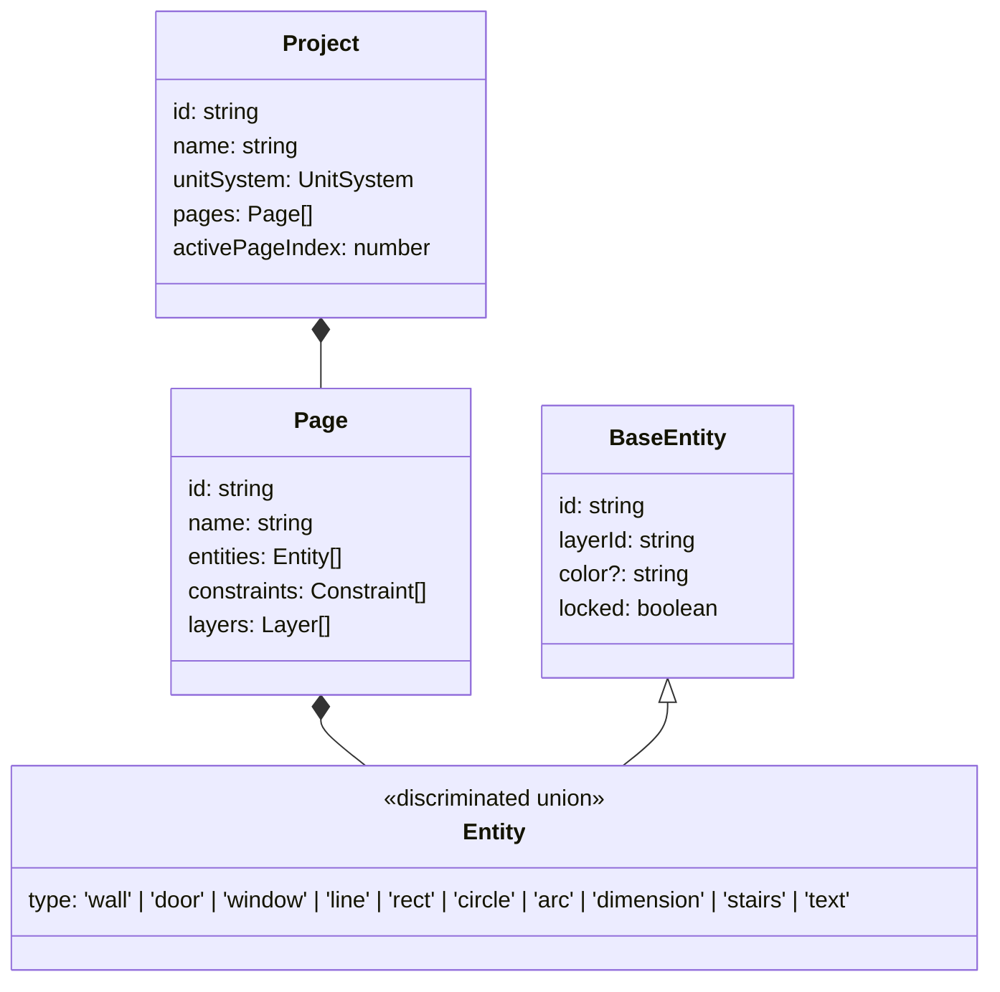

# Quirky-Lavoisier — Data Models

> Last reviewed: 2026-06-18

## Overview
The data model of Quirky-Lavoisier relies on a strictly typed hierarchy. The core domain is built upon TypeScript discriminated unions, defining all physical and logical elements of a 2D CAD application. All logic resides purely in `src/core/types.ts` and `src/core/entity.ts`.

## Type/Model Hierarchy

## Entity Relationships and Conventions
- **World Space Coordinates**: All entity geometries (points, lengths, widths) are stored in World Space.
- **Constraints**: Saved at the `Page` level as an array of `Constraint` objects, referencing entities via their unique string IDs.
- **Parametric Attachments**: `Door` and `Window` entities attach to `Wall` entities. They specify a `wallId` and a parametric `t` value [0, 1] for positioning along the length of the wall.

## Serialization Format
The `Project` object is serialized identically to its TypeScript interface, as a plain JSON object. The state is serialized via `JSON.stringify` into the browser's `localStorage` or to standard `.json` file exports. During deserialization, the parsed object should be strictly validated, although currently handled loosely via `JSON.parse` with minimal runtime safety.

## Technical Debt

- **WARN-003**: Pervasive type safety bypasses. Throughout the codebase, accessing union properties is done using `as any` rather than TypeScript type guards or proper narrowing. This risks runtime errors on property access.

## Revision History
| Date | Change |
|------|--------|
| 2026-06-18 | Initial generation |
