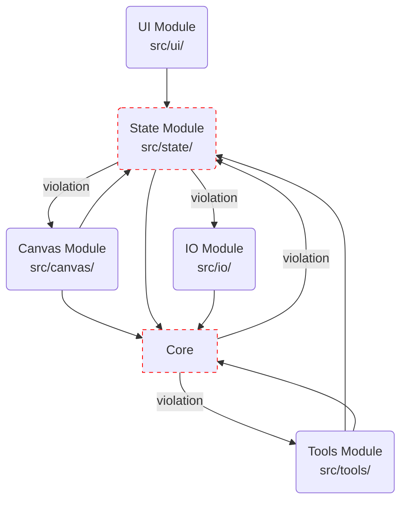

# SlopCAD — Architecture

> Last reviewed: 2026-06-18 | Reviewer: /arch-review

## Overview
SlopCAD is a browser-based 2D architectural plan editor. It is designed to be a lightweight, highly responsive, fully local CAD tool inspired by the aesthetics and layout of AutoCAD. It runs entirely in the browser with no backend, database, authentication, or network calls (except for static assets).

## Tech Stack

| Category | Technology | Version | Notes |
|----------|-----------|---------|-------|
| runtime-framework | Preact | ^10.29.1 | UI rendering (no React) |
| state-management | @preact/signals | ^2.9.1 | Global state management |
| bundler | Vite | ^8.0.12 | Build tool with @preact/preset-vite |
| test-runner | Vitest | ^4.1.8 | Unit and integration testing |
| linter/formatter | gts | ^7.0.0 | Google TypeScript Style |
| types | TypeScript | ^5.6.3 | Strict mode enabled |
| packageManager | npm | - | - |

## Architectural Layers

### Layer Diagram

### Module Responsibilities

#### Core (`src/core/`)
- **Purpose**: Framework-agnostic domain kernel.
- **Key Files**: `types.ts`, `solver.ts`, `geometry.ts`
- **Owns**: Entity types, 2D math, constraints, history, snapping.
- **Must NOT contain**: UI imports, DOM manipulation, framework code.

#### State (`src/state/`)
- **Purpose**: Single source of truth for app state.
- **Key Files**: `app-state.ts`, `preferences.ts`
- **Owns**: Global signals, entity/page/layer CRUD actions.
- **Must NOT contain**: Canvas rendering logic, UI components.

#### Canvas (`src/canvas/`)
- **Purpose**: 2D rendering pipeline and viewport.
- **Key Files**: `canvas-component.tsx`, `draw-helpers.ts`
- **Owns**: Canvas drawing, pan/zoom, event capture.
- **Must NOT contain**: Business logic, state mutations (directly).

#### Tools (`src/tools/`)
- **Purpose**: Interactive state machines for user input.
- **Key Files**: `select-tool.ts`, `wall-tool.ts`, `tool.ts`
- **Owns**: Tool interface, mouse event handling.
- **Must NOT contain**: Rendering routines.

#### UI (`src/ui/`)
- **Purpose**: Non-canvas user interface.
- **Key Files**: `toolbar.tsx`, `properties-panel.tsx`
- **Owns**: Ribbon, command line, status bar, properties.
- **Must NOT contain**: Canvas drawing logic.

#### IO (`src/io/`)
- **Purpose**: File operations and export.
- **Key Files**: `entity-renderers.ts`, `svg-renderer.ts`
- **Owns**: Save/load JSON, SVG/PNG export.
- **Must NOT contain**: Global state management.

## Cross-Cutting Concerns
- **Shared Types**: Centralized in `src/core/types.ts`. However, there's pervasive use of `as any` casts.
- **Error Handling**: Errors are mostly unhandled or implicit. 
- **Test Coverage**: Partial coverage in `core` and `tools`, very thin in `state`, zero functional coverage in `canvas`, `ui`, and `io`.

## Technical Debt

| ID | Severity | File(s) | Principle | Summary |
|----|----------|---------|-----------|---------|
| ⚠️ CRIT-001 | Critical | `src/core/commands.ts` | DIP | Core domain layer imports from higher layers. |
| ⚠️ CRIT-002 | Critical | `src/state/app-state.ts` | SoC | State management layer imports rendering and IO details. |
| ⚠️ CRIT-003 | Critical | `src/canvas/draw-helpers.ts` | SRP | Massive file size and SRP violation in Canvas rendering. |
| ⚠️ CRIT-004 | Critical | `src/state/app-state.ts` | SRP | God-object anti-pattern in global state. |
| ⚠️ CRIT-005 | Critical | `src/core/solver.ts` | SRP | Oversized constraint solver module. |
| ⚠️ CRIT-006 | Critical | `src/ui/toolbar.tsx` | SRP | Oversized UI Toolbar component. |
| ⚠️ CRIT-007 | Critical | `src/canvas/canvas-component.tsx` | SRP | Monolithic Canvas component. |
| ⚠️ CRIT-008 | Critical | `src/tools/select-tool.ts` | SRP | Oversized Selection Tool logic. |
| 🔶 WARN-001 | Warning | `src/canvas/`, `src/io/`, `src/ui/` | Testability | Untested critical modules. |
| 🔶 WARN-002 | Warning | `src/canvas/draw-helpers.ts`, `src/io/entity-renderers.ts` | DRY | Duplicated rendering logic between Canvas and SVG. |
| 🔶 WARN-003 | Warning | `src/core/solver.ts`, `src/tools/select-tool.ts` | Type Safety | Pervasive type safety bypasses via `as any`. |
| 🔶 WARN-004 | Warning | `src/state/app-state.ts`, `src/core/solver.ts` | Testability | Sparse test coverage relative to complexity. |
| 🔶 WARN-005 | Warning | `src/ui/icons.tsx` | SRP | Minor oversized file. |

### Debt Detail

#### CRIT-001 — Core domain layer imports from higher layers
- **Severity**: Critical
- **File(s)**: [src/core/commands.ts](https://github.com/willemsk/slopcad/blob/main/src/core/commands.ts)
- **Principle Violated**: DIP
- **Check**: U1a
- **Detail**: The core module is the foundation of the architecture and must remain pure. `commands.ts` imports `setActiveToolByName` from `../tools/tool-registry` and state actions from `../state/app-state`. This violates the intended layering and creates tight coupling.
- **Suggested Remedy**: Invert the dependency. `commands.ts` should export pure command definitions, and the state/tools should dispatch them.

#### CRIT-002 — State management layer imports rendering and IO details
- **Severity**: Critical
- **File(s)**: [src/state/app-state.ts](https://github.com/willemsk/slopcad/blob/main/src/state/app-state.ts)
- **Principle Violated**: SoC
- **Check**: U1b
- **Detail**: The global state store imports `Viewport` from `../canvas/viewport` and functions from `../io/file-io`. State orchestration should remain ignorant of how rendering is performed or how serialization is implemented.
- **Suggested Remedy**: Abstract dependencies using interfaces or move them closer to where they are invoked.

#### CRIT-003 — Massive file size and SRP violation in Canvas rendering
- **Severity**: Critical
- **File(s)**: [src/canvas/draw-helpers.ts](https://github.com/willemsk/slopcad/blob/main/src/canvas/draw-helpers.ts)
- **Principle Violated**: SRP
- **Check**: U2a
- **Detail**: At 1033 lines, this is the largest file in the codebase. It concentrates all low-level Canvas2D rendering for every entity type.
- **Suggested Remedy**: Decompose the file per entity type (e.g., `draw-walls.ts`, `draw-entities.ts`).

#### CRIT-004 — God-object anti-pattern in global state
- **Severity**: Critical
- **File(s)**: [src/state/app-state.ts](https://github.com/willemsk/slopcad/blob/main/src/state/app-state.ts)
- **Principle Violated**: SRP
- **Check**: U2a / U2b
- **Detail**: This file concentrates all application state (signals) and all mutation functions in a single location, growing to 870 lines.
- **Suggested Remedy**: Decompose into focused state slices (e.g., page actions, layer actions, constraint actions).

#### CRIT-005 — Oversized constraint solver module
- **Severity**: Critical
- **File(s)**: [src/core/solver.ts](https://github.com/willemsk/slopcad/blob/main/src/core/solver.ts)
- **Principle Violated**: SRP
- **Check**: U2a
- **Detail**: Exceeding the 300-line limit by over double, this file contains a monolithic `switch` statement for resolving every constraint type.
- **Suggested Remedy**: Extract constraint logic into separate handlers.

#### CRIT-006 — Oversized UI Toolbar component
- **Severity**: Critical
- **File(s)**: [src/ui/toolbar.tsx](https://github.com/willemsk/slopcad/blob/main/src/ui/toolbar.tsx)
- **Principle Violated**: SRP
- **Check**: U2a
- **Detail**: This component exceeds the 300-line limit, containing inline definitions for all toolbar tabs, tool groups, and rendering logic.
- **Suggested Remedy**: Extract data definitions to a separate configuration or registry file.

#### CRIT-007 — Monolithic Canvas component
- **Severity**: Critical
- **File(s)**: [src/canvas/canvas-component.tsx](https://github.com/willemsk/slopcad/blob/main/src/canvas/canvas-component.tsx)
- **Principle Violated**: SRP
- **Check**: U2a
- **Detail**: The canvas component handles rendering orchestration, input event listening, snapping, and tool dispatch. Snap logic is duplicated four times within it.
- **Suggested Remedy**: Extract snap logic to a helper and decompose input handlers.

#### CRIT-008 — Oversized Selection Tool logic
- **Severity**: Critical
- **File(s)**: [src/tools/select-tool.ts](https://github.com/willemsk/slopcad/blob/main/src/tools/select-tool.ts)
- **Principle Violated**: SRP
- **Check**: U2a
- **Detail**: This tool manages an overly complex state machine and inline hit-testing.
- **Suggested Remedy**: Extract generic hit-testing to a shared utility.

#### WARN-001 — Untested critical modules
- **Severity**: Warning
- **File(s)**: `src/canvas/`, `src/io/`, `src/ui/`
- **Principle Violated**: Testability
- **Check**: U4a
- **Detail**: There are zero functional tests for the canvas rendering pipeline, UI components, and IO serialization/export logic.
- **Suggested Remedy**: Add unit and integration tests.

#### WARN-002 — Duplicated rendering logic
- **Severity**: Warning
- **File(s)**: `src/canvas/draw-helpers.ts` and `src/io/entity-renderers.ts`
- **Principle Violated**: DRY
- **Check**: U5a
- **Detail**: Entity visual representation logic is duplicated between Canvas2D and SVG export.
- **Suggested Remedy**: Create a unified rendering abstraction or adapter pattern.

#### WARN-003 — Pervasive type safety bypasses
- **Severity**: Warning
- **File(s)**: `src/core/solver.ts`, `src/tools/select-tool.ts`, etc.
- **Principle Violated**: Type Safety
- **Check**: None
- **Detail**: Extensive use of `as any` casts to access properties on discriminated unions.
- **Suggested Remedy**: Implement type guards or strict type narrowing functions.

#### WARN-004 — Sparse test coverage relative to complexity
- **Severity**: Warning
- **File(s)**: `src/state/app-state.ts`, `src/core/solver.ts`
- **Principle Violated**: Testability
- **Check**: U4b
- **Detail**: Coverage is insufficient for the complexity of these core components.
- **Suggested Remedy**: Increase test coverage for boundary and edge cases.

#### WARN-005 — Minor oversized file
- **Severity**: Warning
- **File(s)**: [src/ui/icons.tsx](https://github.com/willemsk/slopcad/blob/main/src/ui/icons.tsx)
- **Principle Violated**: SRP
- **Check**: U2a
- **Detail**: Just over the 300-line threshold.
- **Suggested Remedy**: Split into logical icon groups.

## Revision History

| Date | Change | Run |
|------|--------|-----|
| 2026-06-18 | Initial generation | /arch-review |
