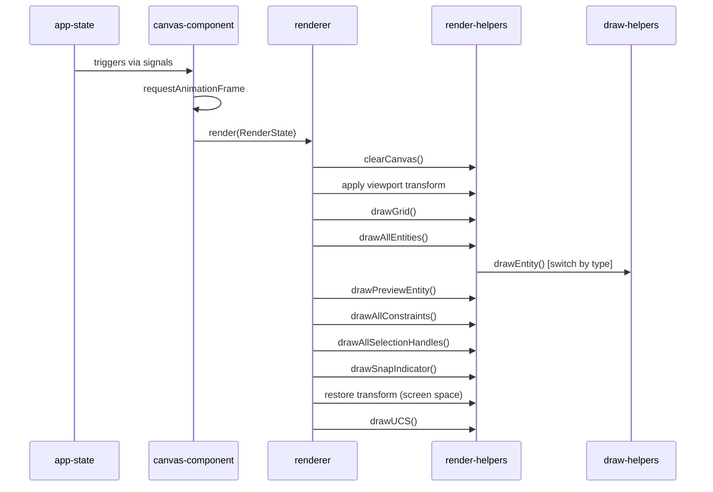

# SlopCAD — Rendering Pipeline

> Last reviewed: 2026-06-18

## Overview
SlopCAD utilizes the HTML5 Canvas 2D API for rendering architectural plans. The pipeline is encapsulated within the `src/canvas/` module and directly maps entities from the application state into vector graphics without intermediary abstraction layers like WebGL or PixiJS. The pipeline operates via a `requestAnimationFrame` loop.

## Render Loop Architecture

## Viewport and Coordinate System
- Coordinates are stored on entities in **World Space** (meters/inches).
- The `Viewport` class handles translation (pan) and scaling (zoom) to convert coordinates to **Screen Space**.
- Important rule: Stroke widths are divided by `viewport.zoom` to remain visually consistent across zoom levels.
- The UI layer (HTML/CSS) is independent of the Canvas rendering. CSS `zoom` is not used on the canvas.

## Export Pipeline
- There is a parallel rendering pipeline using SVG elements located in `src/io/entity-renderers.ts` and `src/io/svg-renderer.ts`.
- It mirrors the logic found in the Canvas `draw-helpers.ts` but constructs an SVG document for export.

## Technical Debt

- **CRIT-003**: Massive file size and SRP violation in Canvas rendering (`draw-helpers.ts` is 1033 lines).
- **CRIT-007**: Monolithic Canvas component (`canvas-component.tsx` handles rendering, input, snapping, and tool dispatch).
- **WARN-001**: Untested critical modules (no functional rendering tests).
- **WARN-002**: Duplicated rendering logic between Canvas2D (`draw-helpers.ts`) and SVG (`entity-renderers.ts`).

## Revision History
| Date | Change |
|------|--------|
| 2026-06-18 | Initial generation |
